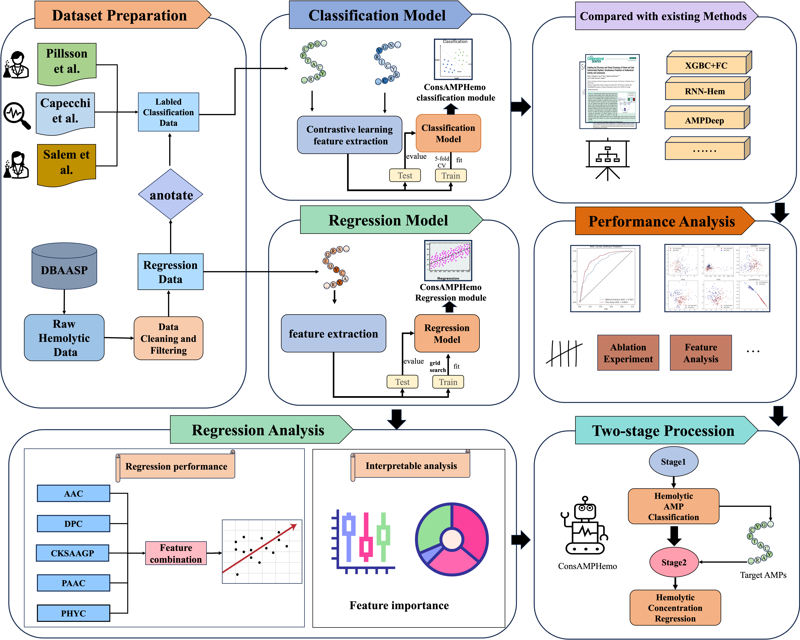
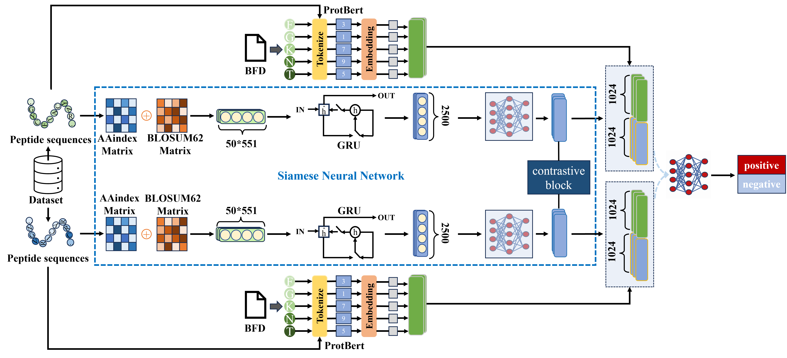

# ConsAMPHemo

A model for AMP hemolytic classification and regression


## abstract

Many antimicrobial peptides (AMPs) function by disrupting the cell membranes of microbes. While this ability is crucial for their efficacy, it also raises questions about their safety. Specifically, the membrane-disrupting ability could lead to hemolysis. Traditionally, the hemolytic activity of AMPs is evaluated through experiments. To reduce the cost of assessing the safety of an AMP as a drug, we introduce ConsAMPHemo, a two-stage framework based on deep learning. ConsAMPHemo performs conventional binary classification of the hemolytic activities of AMPs and predicts their hemolysis concentrations through regression. Our model demonstrates excellent classification performance, achieving an accuracy of 99.54%, 82.57%, and 88.04% on three distinct datasets, respectively. Regarding regression prediction, the model achieves a Pearson correlation coefficient of 0.809. Additionally, we identify the correlation between features and hemolytic activity. The insights gained from this work shed light on the underlying physics of the hemolytic nature of an AMP. Therefore, our study contributes to the development of safer AMPs through cost-effective hemolytic activity prediction and by revealing the design principles for AMPs with low hemolytic toxicity.


## Conclusion

In this study, we introduce ConsAMPHemo, a two-stage machine learning framework to predict 
the hemolytic activities of AMPs.The first stage is a binary classification of AMPs' hemolytic activities. By combining contrastive learning with ProtBert-BFD, effective separation of samples from different hemolytic classes can be achieved. The focal loss function was also employed to address the issue of data imbalance when training the model using an unbalanced dataset. The second stage involves a regression model for predicting the value of $HC_{50}$, a quantitative measurement of hemolytic activity. Hand-crafted features and XGBoost were employed for the model construction. While good performance was observed in both stages, Shapley value analysis identified features relevant to predicting $HC_{50}$. These important features include those that are related to the origin of hemolytic activities, such as transmembrane propensity. Others are features that contribute to noticeable distinctions between high-hemolytic and low-hemolytic AMPs, such as net charge, lysine (L), tryptophan (W), etc. The results of this work hence are valuable in guiding future research to design low-hemolytic AMPs.


## Workflow





## Linux and Windows
Please make sure that cuda is available，python version is 3.10
```
pip install pytorch Transformer scikit-learn
```
or you can run the following command

```
pip install -r requirements.txt
```

## Model




## 1. Train

```
python3 train.py
```


## 2. Evaluate

```
python3 evaluate.py
```


## 3. Dataset and our trained model

```
Dataset/S_i/model
```

